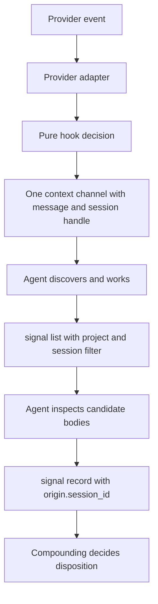

# Signal Reflection And Session Provenance

**Date:** 2026-09-11
**Status:** implemented (SR1-SR4)
**Repo Scope:** agent-knowledge-scaffold
**Primary PR Repo:** agent-knowledge-scaffold

## 1. Plan Brief

### 1.1 Outcome

Give the agent one source-owned, idempotent reflection reminder and the exact
opaque provider session handle needed to avoid duplicate same-session signals,
while keeping signal validation, listing and compounding explicit and
deterministic.

### 1.2 Feature Shape

#### Today

H1-H4 provide an advisory discovery hook for session start and exposed resume
events. The Codex and Claude adapters accept `session_id`; the Copilot adapter
accepts `sessionId`; however, the value is retained only in the normalized
event and is not shown to the model. The hook currently emits a static
discovery message and does not remind the agent to reflect or record a signal.

`knowledge-signal.v1` already stores provider provenance fields, but
`origin.session_id` is optional and `signal list` can only select project/shared
inboxes and pages. An agent therefore cannot reliably copy the current session
handle into a signal or inspect pending signals from that session before
recording another observation. Compounding is the final owner of duplicate and
no-update decisions, but it currently receives no session-filtered discovery
help from the CLI.

The provider matrix in [knowledge-hook-runtime.md](knowledge-hook-runtime.md)
has since been updated for Copilot CLI 1.0.86. Codex and Claude expose
model-visible `UserPromptSubmit`; Copilot exposes model-visible
`userPromptTransformed`. All three expose a usable session-start path, and
resume behavior is provider-specific. Copilot still has no model-visible
post-compaction event. There is no common durable `thread_id`.

#### Planned Delta

Add one canonical reflection reminder resource. The startup/resume and
provider-exposed post-compaction discovery message includes that same
reflection text and the exact provider session handle. Where documented
model-visible prompt hooks exist, all three providers receive the reflection
reminder on every user prompt. Copilot uses `userPromptTransformed`; the plan
does not emulate post-compaction with a blocking or notification event or add a
separate signal-writing hook.

The provider adapters will expose the received opaque session handle in the
single context channel they already use. The agent is instructed to copy the
value exactly into `origin.session_id`. A signal with `origin.harness` set is a
harness-origin signal and is rejected when `origin.session_id` is missing or
invalid. Signals authored without harness provenance may still omit the
session handle.

`signal list` gains an exact, optional `session_id` predicate. The reminder and
authoring guide tell the agent to list pending signals for the current
workspace/project/session before recording a useful observation, inspect likely
equivalents, and avoid a duplicate. An agent with no useful observation records
nothing. Scheduled compounding starts with an unfiltered inventory across
authoring sessions in the configured project/shared buckets. The CLI does not
judge equivalence, and the hook does not read signals; compounding remains
responsible for final duplicate, keep, update, skip or no-update dispositions.



### 1.3 Must Preserve

- The scaffold remains organization-neutral and has no legacy compatibility
  layer, organization-specific variables, copied corpus or common provider thread ID.
- One authored instruction and one packaged reminder resource own the wording;
  provider adapters, generated projections and skills reference that owner
  rather than copying competing instructions.
- The hook remains advisory, non-blocking, fail-open and single-channel. It
  never searches, previews, reads files, plans queries, infers taxonomy,
  traverses links, reads transcripts or invokes compounding.
- A provider session handle is opaque provenance for one harness session. It is
  not a signal identity, a project identity or a durable cross-provider key.
- Missing `origin.session_id` is allowed only when the signal has no harness
  provenance. A harness-origin signal cannot bypass the requirement by using a
  path, automation ID or fabricated placeholder.
- `signal list` filtering is exact and literal. It must not case-fold,
  substring-match, infer aliases or broaden the selected project/shared
  buckets.
- The agent decides whether an observation is worth recording; compounding
  decides whether an equivalent signal becomes canonical. The CLI does not
  silently deduplicate or delete inputs.
- Existing optional search/inspect receipts remain operation traces. They are
  not hook state, signal deduplication state, session replay or proof that a
  body was read.

### 1.4 Capabilities Delivered

| Status | ID | Capability | Expected Behavior | Important Conditions | Proof Signal |
| --- | --- | --- | --- | --- | --- |
| [x] | C1 | Canonical reflection reminder | One packaged reminder contains the idempotent same-session reflection and signal-recording instruction. Startup/resume output embeds it; prompt-capable providers reuse it. | The hook text is an activation nudge, not a second knowledge guide. The wording is authored once and rendered with a session value. | Resource parity tests, package install checks and generated-instruction ownership checks. |
| [x] | C2 | Exact session context delivery | Codex, Claude and Copilot model-visible hook output contains the exact received provider handle, unmodified, in the one supported context channel. | Missing/malformed handles never become placeholders or inferred IDs; malformed provider events fail open without blocking work. | Adapter fixtures for `session_id` and `sessionId`, one-channel assertions and missing-ID tests. |
| [x] | C3 | Provider lifecycle coverage | Codex and Claude receive reflection at `UserPromptSubmit`; Copilot receives it at `userPromptTransformed`. All three receive supported startup/resume events, and providers with a model-visible post-compaction path receive the same discovery/reflection context. Copilot has no direct event after in-session compaction; always-on discovery instructions remain and the next prompt receives reflection only. | Do not register `Stop`, `TaskCompleted`, `agentStop`, `PreCompact`, `PostCompact` or `SessionEnd` merely to approximate this behavior. | Registration fixtures, provider capability matrix and live harness checks. |
| [x] | C4 | Conditional signal provenance | A signal with `origin.harness` must contain a valid nonempty `origin.session_id`; a manual/non-harness signal may omit it. | Preserve the exact opaque value. Do not require a cross-provider `thread_id` or infer provenance from paths. | Domain/schema tests and signal-record integration tests for accepted and rejected origins. |
| [x] | C5 | Session-filtered signal listing | `signal list` accepts one exact `session_id` filter and returns only matching previews after normal workspace/project/shared selection. | The filter is case-sensitive and literal; continuation fingerprints include it; signal bodies are still not returned by listing. | Query parsing, project/shared, exact-match, empty-result and pagination integration tests. |
| [x] | C6 | Agent-side same-session dedup guidance | Before recording, the agent lists pending signals for the current session and inspects likely equivalents; it records at most one concise observation for the same issue. | This is guidance, not a CLI duplicate check. Compounding retains final duplicate/no-update authority. | Skill/guide contract tests and a documented CLI walkthrough with two same-session candidates. |
| [x] | C7 | Safe hook boundary | Reflection context adds no filesystem, receipt, transcript, model, network, scheduler or retrieval behavior. Hook failures remain non-blocking. | No hook state or generic completion receipt returns. | Import/mocking guards, no-receipt assertions and malformed-event/fail-open tests. |
| [x] | C8 | Provider acceptance proof | Exact session propagation is proven for all three adapters and live CLIs. | Live runs use disposable provider configurations and retain explicit failures rather than replacing them silently. | Live Claude startup/resume/prompt proof plus live Codex and Copilot prompt/session evidence. |

## 2. Build Contract

### 2.1 Delivery Slices

The slices are a dependent stack. Each slice leaves the repository green and
carries its own tests. SR1-SR4 are implemented; the acceptance evidence below
is the current proof record.

| Slice | Capabilities Covered | Repo | Base / Stack Parent | Existing Surface / Likely Touchpoints | Notes |
| --- | --- | --- | --- | --- | --- |
| SR1: Session-aware hook contract and reminder resource | C1-C3, C7 | agent-knowledge-scaffold | `origin/main` | `domain/hooks.py`, `entrypoints/hooks/adapters.py`, `resources/hook_messages.py`, one packaged reminder resource, hook manifest and unit fixtures | Add the canonical reflection block, dynamic session rendering, provider event/output mappings and strict one-channel behavior. Keep domain decisions pure and provider parsing at the adapter edge. |
| SR2: Signal provenance and exact session listing | C4-C5 | agent-knowledge-scaffold | SR1 | `domain/models.py`, `domain/schema.py`, `domain/signals.py`, `application/signals.py`, CLI contracts, signal template and signal tests | Make the harness-origin rule explicit, add `session_id` to the list request, include it in pagination identity and expose it in `describe`. Preserve manual signal authoring without harness provenance. |
| SR3: Agent workflow and setup integration | C1, C3, C6-C7 | agent-knowledge-scaffold | SR2 | `docs/agent-contract.md`, `packages/knowledge-agent-pack/.apm/instructions/`, `knowledge-compound`, setup hook registration, APM projections and package docs | Teach exact ID copying, same-session `signal list`, body inspection and compounding ownership. Register provider-native prompt hooks, including Copilot `userPromptTransformed`, without inventing a post-compaction event. |
| SR4: Fresh-consumer and provider proof | C1-C8 | agent-knowledge-scaffold | SR3 | `tests/e2e/`, fresh-consumer drivers, provider fixtures, `docs/fresh-consumer.md`, `ai/plans/knowledge-hook-runtime.md` and this plan | Prove install/projection parity, exact context delivery and signal validation in an isolated consumer. Retain explicit unavailable outcomes, and record live proof whenever each authenticated provider surface is available. |

#### Post-review corrections (2026-09-12)

The canonical reminder now explicitly says to record nothing when there is no
useful observation, while preserving same-session list/inspect before recording
one. Scheduled compounding's initial inventory omits the session filter and
follows pagination across the configured project/shared buckets. The template,
`describe`, guide and CLI walkthrough all explain that harness provenance
requires the exact session ID, manual signals may omit both fields, and the
automation ID is independently optional.

The reusable Claude acceptance driver now requires setup's absolute managed
hook launcher and checks both its ownership sidecar and active runtime
settings. Its first model turn receives the session ID only from hook context,
lists that session and records a fictional signal. The resumed turn lists and
reads the stored signal, then independently decides whether another record is
warranted. Assertions require exact Claude/session provenance, one matching
signal and unchanged bytes. Hook transport evidence is retained separately if
model behavior fails. The driver keeps the non-blocking failing-hook check.
See [the provider proof instructions](../../docs/r8-harness-proof.md) for the
bounded opt-in invocation.

Live verification passed in Claude Code **2.1.236** with exact model
`claude-opus-5`, an explicit opt-in to existing account authentication, and
the retained fresh consumer. Startup, resume and prompt delivery used the
same session ID and one context channel. The model returned
`MODEL_RECORD_OK` and `MODEL_DEDUP_OK`; its recorded signal retained exact
provenance and unchanged bytes after same-session listing/body inspection,
with no duplicate. A hook that exited 127 still allowed `FAIL_OPEN_OK`.
Consumer settings were restored unchanged. Evidence is retained locally in
`.cache/review-fixes-claude.json`. The 12 focused Claude driver tests passed;
the full repository suite passed 1,010 tests, and final lint/format checks
passed. Later 2026-09-21 acceptance added live Codex and Copilot semantic
retrieval, exact-session signal capture, resume and duplicate suppression.
Copilot 1.0.86 also live-proved `userPromptTransformed` delivery. No recurring
automation was created by this hook-focused flow.

### 2.2 Implementation

#### Data Model

- Keep `HookEvent.session_id` optional at the raw adapter boundary so malformed
  provider input can be recognized without inventing a value. A normal eligible
  event must carry a nonblank opaque handle before the reflection portion is
  rendered.
- Render a provider-neutral decision plus a message identifier; pass the
  session handle only to the outer resource renderer. The pure `domain` module
  remains free of environment, filesystem, provider and clock effects.
- Keep `SignalOrigin.session_id` nullable for non-harness/manual signals. Add a
  domain invariant: if `SignalOrigin.harness` is present, `session_id` must be a
  valid bounded opaque handle. `automation_id` does not satisfy this invariant.
- Add `SignalListQuery.session_id: str | None`. It represents one exact value,
  not a list, prefix, alias or text search. Signal preview output already
  exposes the origin handle and continues to do so.
- Do not alter generated signal IDs or use a session handle as a filename. A
  session filter is a provenance view only.

#### API Contract

The model-visible hook context must contain the canonical reminder and a line
equivalent to:

```text
Provider harness (copy exactly into origin.harness for a harness-origin signal): <provider>
Provider session ID (copy exactly into origin.session_id for a harness-origin signal): <opaque-session-id>
```

The provider is emitted from the normalized hook adapter. The session value is
inserted verbatim and is never URL-decoded, case-folded, truncated,
path-expanded or replaced with a `thread_id`. A payload without a usable handle
produces no reflection context (and a safe no-op/diagnostic at the hook
boundary); it never exposes a fake placeholder.

`Codex` and `Claude` map the eligible lifecycle and prompt decisions to their
documented `hookSpecificOutput.additionalContext` field. Their supported
post-compaction `SessionStart` paths use the same field. `Copilot` maps
session-start/resume to `additionalContext` and prompt reflection to
`modifiedTransformedPrompt`. It has no model-visible post-compaction path, so
the next user prompt carries reflection. Each invocation populates at most one
model-visible context channel.

The `signal list` request becomes:

```yaml
include_shared: true
session_id: "opaque-session-id"
limit: 50
```

The installed agent-facing example will use the same explicit configuration
contract:

```bash
agent-knowledge --config /work/knowledge/knowledge-workspace.yaml signal list \
  --request-file - <<'YAML'
include_shared: true
session_id: "opaque-session-id"
limit: 50
YAML
```

The result preserves the existing preview-only response and returns only rows
whose `origin.session_id` equals the supplied value. `session_id` participates
in the request fingerprint used by continuation cursors, so a cursor cannot be
reused for another session filter. An omitted filter preserves current
project/shared listing behavior.

Signal validation reports a field error at `origin.session_id` when
`origin.harness` is set but the handle is absent, blank or malformed. Manual
signals with no harness provenance remain valid without a session value.

#### Events / Messages

The source-owned reminder has two composable blocks:

```text
Before engineering work, run `agent-knowledge describe`, then use targeted
`search` and `inspect` calls for the task. Follow the installed guide.

At a natural stopping point, reflect once. Before recording, list pending
signals for this workspace and inspect entries from this project/session. If
the same observation is already present, do not record another. Otherwise
author and record one concise `knowledge-signal.v1` note using the installed
template and configured workspace. Compounding decides what becomes canonical.
```

The discovery message uses both blocks. A supported user-prompt hook uses the
reflection block, so repeated prompts do not repeat the full discovery guide.
Both add the exact session-ID line. The agent is told to preserve the handle
exactly and to omit harness provenance rather than fabricate it if no handle is
available.

The reminder is deliberately idempotent in wording. The hook does not keep a
per-prompt or per-session “already reminded” file, replay prior results or
interpret receipts. Repeated delivery is tolerated by the agent workflow,
which checks pending same-session signals before writing.

#### Business Rules

1. Provider adapters normalize only documented payload fields. Codex and Claude
   use `session_id`; Copilot uses `sessionId`; no adapter derives an ID from a
   transcript, cwd, prompt, automation name or process ID.
2. A normal provider event with a nonempty handle delivers the exact handle in
   the single selected context field. A missing, null, malformed or conflicting
   handle is an unsupported event at the hook boundary and fails open without
   blocking the agent.
3. Startup/resume and supported post-compaction behavior remains
   lifecycle-driven. Codex and Claude use `UserPromptSubmit`; Copilot uses
   `userPromptTransformed`. Copilot receives no synthetic post-compaction hook.
4. Do not use task-stop/completion events as a reflection substitute. They may
   block, continue a conversation, lack model-visible output or fire at the
   wrong boundary.
5. Before `signal record`, the agent uses `signal list` with the exact current
   session ID and relevant project/shared selection, previews candidates and
   reads only likely equivalent bodies with ordinary file tools. The agent may
   decide that no signal is warranted.
6. The CLI rejects harness-origin signals without a session ID but does not
   decide whether two valid signal bodies are equivalent. Compounding records
   the final disposition and owns canonical updates.
7. Exact session filtering composes with the existing workspace/project/shared
   routing. It never expands organization scopes, follows graph links or
   searches canonical knowledge bodies.
8. Session handles may appear in signal previews and controlled acceptance
   evidence because they are provenance. Do not copy transcripts, prompts,
   credentials or arbitrary provider payloads into signals or receipts.
9. The canonical reminder resource, source instruction, installed guide and
   skills must remain synchronized through APM compilation. Provider adapters
   contain transport wrappers only; they do not author alternate instructions.

#### Config

- Add no organization-specific configuration and no common thread setting.
- Keep the existing package-owned hook marker and absolute installed launcher.
  Setup registers `UserPromptSubmit` for Codex/Claude and translates Copilot's
  portable marker to `userPromptTransformed`; it registers the session path for
  all supported providers and reports unavailable providers individually.
- The reminder resource is packaged once and loaded by the outer renderer;
  generated `AGENTS.md`, `CLAUDE.md` and Copilot projections reference the
  source-owned instruction. No shell startup edits or ambient environment
  variables are introduced.
- `session_id` is a request field, not a workspace setting. Signal storage,
  source roots, scope catalogs, runtime paths and automation cadence remain
  governed by the existing explicit workspace configuration.

#### Automated Tests

| Capability | Test Level | Existing / New Surface | What The Test Proves |
| --- | --- | --- | --- |
| C1 | unit/package | Resource renderer tests and package contract fixtures | Discovery and reflection wording has one source, remains bounded, includes the agent's same-session workflow and is available from a fresh wheel. |
| C2-C3 | unit/integration | `tests/unit/entrypoints/hooks/`, `tests/integration/`, provider registration fixtures | Exact Codex `session_id`, Claude `session_id` and Copilot `sessionId` values appear once in the proper context channel; all three prompt registrations use their supported native event/output; malformed events fail open. |
| C4 | unit/integration | `tests/unit/domain/test_schema.py`, `test_signals.py`, signal-record integration tests | Harness-origin signals require a valid session handle while manual signals remain valid without one; no path or automation fallback satisfies the rule. |
| C5 | unit/integration | Signal query parser, application listing and CLI contract tests | Exact session filtering composes with project/shared selection, returns zero for nonmatches, preserves preview-only behavior and invalidates/rejects mismatched continuation cursors. |
| C6 | package/acceptance | `knowledge-compound` and `docs/agent-contract.md` contract fixtures plus CLI walkthrough | The installed workflow teaches list-then-inspect before record, exact ID copying and compounding ownership without promising deterministic deduplication. |
| C7 | unit/integration | Hook import guards, runtime tests and receipt tests | Hook execution performs no retrieval/file/receipt/model work and remains advisory when provider input or output is unusable. |
| C8 | acceptance/e2e | Fresh consumer and provider drivers under `tests/e2e/` | Live Claude proves startup/resume/prompt propagation; live Codex and Copilot prove exact prompt/session propagation, semantic retrieval, signal capture and resume deduplication. |

The fast semantic tests run entirely in memory. Filesystem, packaging and
provider checks remain integration or acceptance tests. Every provider proof
must redact prompts, credentials and unrelated transcript content.

#### Provider acceptance matrix

| Provider | Session field | Discovery delivery | Reflection delivery in this plan | Required proof |
| --- | --- | --- | --- | --- |
| Codex | `session_id` | Native start/resume/clear/compact context hook | `UserPromptSubmit` when the installed CLI exposes its documented context output | Fixture exact propagation; live check when CLI/auth capability is available. |
| Claude Code | `session_id` | `SessionStart` startup/resume/clear/compact paths where exposed | `UserPromptSubmit` with model-visible context | Live disposable Claude run using exact Opus 5 model, same-session ID across resume and prompt delivery; synthetic compaction if live trigger is unavailable. |
| GitHub Copilot CLI | `sessionId` | Native `sessionStart` source branching for startup/resume | Native `userPromptTransformed` reflection; no direct model-visible event after in-session compaction | Fixture exact propagation plus live 1.0.86 initial/resumed prompt and signal-provenance proof. |

The live Claude driver must capture the native session ID, assert that the hook
response contains that exact value, and exercise a controlled signal authoring
path that passes the same value to `origin.session_id`. If the model cannot
complete the controlled authoring step, the driver still records the hook
transport result separately and does not claim end-to-end agent copying.

### 2.3 Deployment

This is local package and harness configuration work. There is no daemon,
scheduler, database migration or remote service. The order is SR1, SR2, SR3,
then SR4. Re-running setup/APM compilation reconciles the package-owned hook
registration without removing unrelated provider configuration.

Rollback is a package revision revert or disabling/removing the package-owned
hook registration. It does not delete signals, receipts or user-authored
configuration. Since this scaffold has no compatibility requirement, no legacy
session-field migration or old-hook shim is planned.

## 3. Appendix

### 3.1 Context Used

- [`ai/plans/organization-neutral-knowledge-core.md`](organization-neutral-knowledge-core.md) — fresh-core boundaries, Markdown signal contract, pure domain, setup and compounding ownership.
- [`ai/plans/knowledge-hook-runtime.md`](knowledge-hook-runtime.md) — implemented H1-H4 hook boundary, one-channel delivery and provider capability matrix.
- [`docs/agent-contract.md`](../../docs/agent-contract.md) — current agent-facing discovery, preview/inspect and signal workflow contract.
- [`src/agent_knowledge/domain/schema.py`](../../src/agent_knowledge/domain/schema.py) and [`src/agent_knowledge/domain/signals.py`](../../src/agent_knowledge/domain/signals.py) — current optional origin handle and signal-list request semantics.
- [`src/agent_knowledge/entrypoints/hooks/adapters.py`](../../src/agent_knowledge/entrypoints/hooks/adapters.py) and [`src/agent_knowledge/resources/hook_messages.py`](../../src/agent_knowledge/resources/hook_messages.py) — current adapter normalization and static message rendering gap.
- [`src/agent_knowledge/resources/templates/signals/signal.md`](../../src/agent_knowledge/resources/templates/signals/signal.md) — current frontmatter authoring shape and session placeholder.

### 3.2 Additional Notes

This plan does not change code, register providers or create signals. It is a
new follow-up to H1-H4, not a compatibility layer for the earlier organization-specific
implementation. Provider-session IDs are useful for same-session provenance
and filtering only; they are not expected to remain stable across a new
session, fork or provider.
